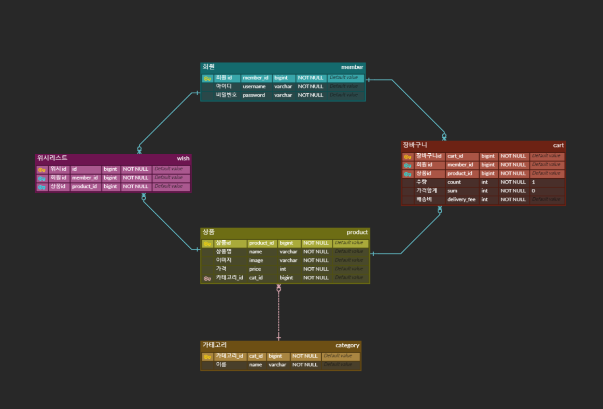

# IKEA 클론코딩

🎬 **[서비스 시연 및 발표 영상]()**

👩 **[팀 노션]()**

 

## 👥 팀 소개
### Backend
- 송민진
- 전혜진
- 김성준

### Frontend
- 임연주
- 유민아

 

## 🗓 프로젝트 기간
- 2022년 9월 9일 ~ 2022년 9월 15일

- 배포 : 2022년 9월 15일

 

## 📜 기술스택
|분류|기술|
| :-: |:- |
|Language||
|Framework| |
|Build Tool||
|DB||
|Server| |
|CI/CD| |

 

## 아키텍쳐
이미지 준비중
 

##  ER 다이어그램

 

## 기술적인 도전

1. Github actions + Codedeploy를 사용하여 자동화 배포 적용
2. 데이터 크롤링
3. LogBack 설정
4. 비회원으로 위시리스트/장바구니 기능 구현 (쿠키 생성)
    
